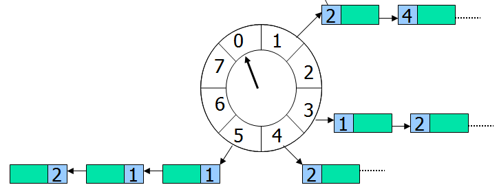

### 真实场景1：  注册网站后，10分钟内没关注公众号的用户，给他发送关注公众号的提醒

### 真实场景2：  假设一个表单有2页，由于没法判断用户提交了第1个表单之后，第二页还需要多久填完，也可能不填，所以设置了一个等待时间（10分钟），用户提交第一个表单后插入数据，等待10分钟。如果超时，则将数据发送给后台,如果马上填完，则终止等待时间，将数据立刻发送给后台。
 
### 【解决方案1_轮询扫描法】：

a,b,c,d等新用户注册后，将uid+last_reg_time写入一个集合中，然后启动一个timer定时器，不断的判断集合中有无新用户注册，如果有，则继续循环出这个集合的所有用户，然后一个个的判断是否超过10分钟了。

注册用户少，这个倒可行，如果注册量很大，十万几十万的用户，则这个集合将非常大，轮询的效率也低。

### 【解决方案2_多timer触发法】

a,b,c,d等用户注册后，各自启动一个定时器timer，10分钟后触发，触发时，判断用户是否关注了公众号，没关注则提醒。

### 方案的缺点：

	方案一：只启动一个timer，但需要轮询，效率较低

	方案二：不需要轮询，但每个请求包要启动一个timer，比较耗资源

### 环形队列解决方案

### 优势：

    （1）只需要1个timer

    （2）timer每1s只需要一次触发，消耗CPU很低

    （3）批量超时，Current Index扫到的slot，Set中所有元素都应该被超时掉

